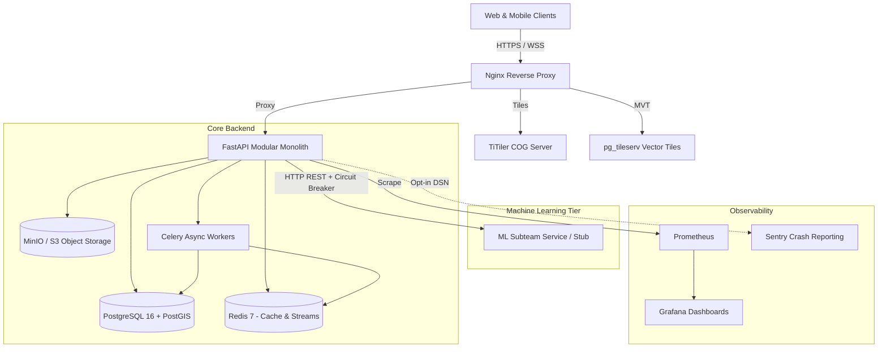

# JalRakshak AI — Backend Architecture & System Design

**Problem Statement**: SIH26071 — Smart India Hackathon 2026  
**Theme**: Disaster Management  
**Team**: NeuroBots (Subteam 2: Backend + Platform Engineering)

---

## 1. Architectural Philosophy & Boundaries

JalRakshak AI backend is architected as a **resilient modular monolith** with specialized geospatial and analytical compute engines:

1. **Public Trust Boundary**:
   - Web and mobile clients interact exclusively through the backend API gateway.
   - Database, Redis, MinIO buckets, and internal ML services remain isolated behind internal Docker/VPC networks.
2. **Strict ML Model Boundary**:
   - Backend never directly imports PyTorch, CUDA runtime, or deep learning weights.
   - All AI inference (precipitation nowcasting, hydrodynamic inundation, vision verification) is orchestrated over HTTP contracts (`internal-ml-openapi.yaml`) with circuit breaker protection and automated fallback.
3. **Decoupled Geospatial Serving**:
   - **Raster COG Tiles**: Served via Cloud-Optimized GeoTIFFs through TiTiler with HTTP caching and ETag validation.
   - **Vector MVTs**: Served directly from PostGIS via pg_tileserv for dynamic risk boundaries and asset overlays.
4. **Append-Only Immutability**:
   - Weather source telemetry artifacts, incident event histories, and cryptographic audit logs are strictly append-only.
5. **Fail-Safe Operational Guardrails**:
   - Routing engine provides advisory lower-risk routes but is never labeled "guaranteed safe".
   - Emergency resource allocation uses Google OR-Tools MIP optimization but strictly prohibits auto-dispatch without human authorization.

---

## 2. High-Level Component Diagram

---

## 3. Core Subsystems

### A. Geospatial Risk Engine (H3 + PostGIS)
- **Spatial Resolution**: Uber H3 discrete global hexagonal grid system (Resolution 8-9).
- **Indexing**: PostGIS GIST spatial indexing on point and polygon geometries.
- **Dynamic Bounding Boxes**: `GET /api/v1/risk/cells?bbox=&valid_time=` with sub-50ms query latency.

### B. Event-Driven Realtime Engine
- **WebSocket Gateway**: `WS /api/v1/live` supporting connection recovery using sequential `event_id` cursors.
- **Transactional Outbox**: Guarantees at-least-once message delivery from relational database transactions to Redis stream workers.

### C. Resource Optimization Engine (Google OR-Tools)
- Solves mixed-integer programming (MIP) formulation to allocate dewatering pumps, rescue teams, and relief shelters.
- Maximizes incident priority coverage and zone risk mitigation while minimizing flood transit times.
- Mandates explicit human operator review before task creation.

### D. Cryptographic Audit System
- Calculates tamper-evident SHA-256 `before_hash` and `after_hash` for state changes.
- Records actor, role, timestamp, trace_id, action, entity, and supporting model snapshots.

---

## 4. Technology Stack Summary

| Layer | Component | Version | Purpose |
| :--- | :--- | :--- | :--- |
| **Framework** | FastAPI | 0.111.0 | High-performance asynchronous REST & WebSocket gateway |
| **Database** | PostgreSQL + PostGIS | 16-3.4 | Relational spatial persistence with temporal indexing |
| **ORM & Driver** | SQLAlchemy + asyncpg | 2.0.30 | Async database session management & connection pooling |
| **Cache & Queue** | Redis | 7.0 | In-memory caching, Pub/Sub, and Celery broker |
| **Workers** | Celery | 5.4.0 | Asynchronous model runs, notifications, and telemetry sync |
| **Optimization** | Google OR-Tools | 9.15.0 | Linear and mixed-integer response resource optimization |
| **Object Store** | MinIO / S3 | Release 2024 | Cloud-native private storage for satellite, radar, & photos |
| **Raster Tiles** | TiTiler | Latest | Cloud-Optimized GeoTIFF raster map tile generation |
| **Vector Tiles** | pg_tileserv | Latest | Dynamic PostGIS Mapbox Vector Tile generation |
| **Observability** | Prometheus + Grafana | Latest | Telemetry monitoring, operational metrics, & dashboards |
| **Reverse Proxy** | Nginx | 1.25 | TLS termination, rate limiting, and WebSocket proxying |
