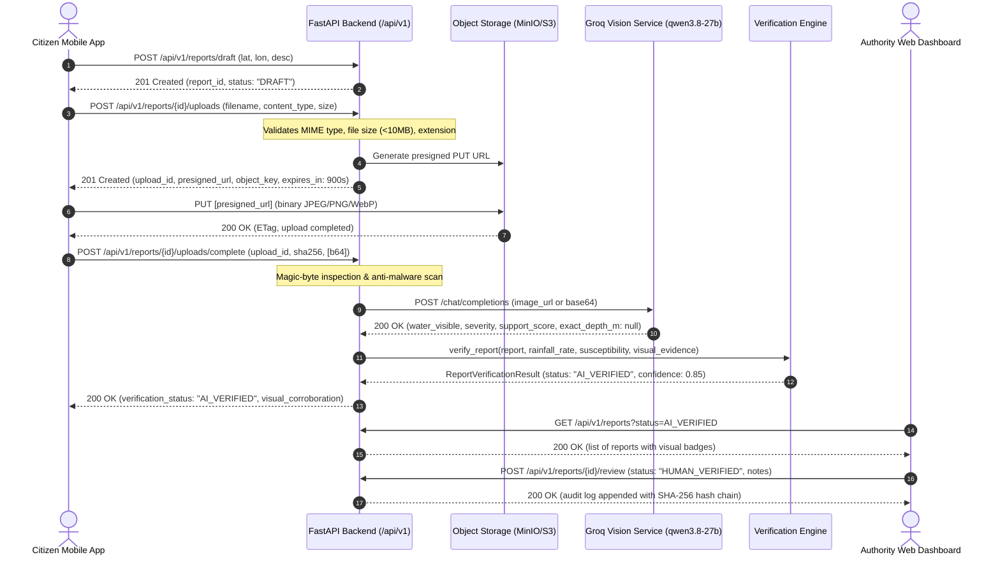

# JalRakshak AI — Citizen Field Report & Media Flow Specification

---

## 1. Architecture & Verification Philosophy

Citizen flood reports provide ground-level crowd observations during urban flood emergencies.
However, raw citizen submissions cannot be treated as authoritative ground truth without multi-source corroboration.

JalRakshak AI enforces a **strict dual-layer verification protocol**:
1. **Environmental Consistency**: Cross-references coordinates with radar/nowcast rainfall rates and high-resolution DEM topographic susceptibility.
2. **Visual Evidence Corroboration**: Analyzes uploaded photographs using Groq's multimodal vision model (`qwen/qwen3.8-27b`).

> [!IMPORTANT]
> **Strict Scientific Claim Gate: Monocular Water Depth Mandate**
> - Consumer smartphone photos are uncalibrated 2D projections without known camera intrinsics, scale references, or ground plane geometry.
> - Therefore, `exact_depth_m` is **MANDATORILY null** in all vision AI payloads.
> - Visual analysis only detects scene elements (e.g., standing water, submerged road markings, stranded vehicles, building ingress) and assigns a bounded corroboration score $[0.0, 1.0]$.
> - Physical flood depths are generated **only** by calibrated hydrodynamic models (e.g., LISFLOOD-FP / SWMM).

---

## 2. End-to-End Sequence Diagram



---

## 3. Detailed Step Contracts

### Step 1: Draft Creation
- **Endpoint**: `POST /api/v1/reports/draft` (or `POST /api/v1/reports`)
- **Headers**: `Authorization: Bearer <jwt>`
- **Request Body**:
  ```json
  {
    "latitude": 19.0728,
    "longitude": 72.8711,
    "description": "Rising water submerging vehicle wheels under railway bridge",
    "incident_id": null
  }
  ```
- **Response** (`201 Created`):
  ```json
  {
    "report_id": "9b1deb4d-3b7d-4bad-9bdd-2b0d7b3dcb6d",
    "citizen_id": "cit-8821",
    "latitude": 19.0728,
    "longitude": 72.8711,
    "description": "Rising water submerging vehicle wheels under railway bridge",
    "verification_status": "DRAFT",
    "submitted_at": "2026-09-10T02:10:00Z"
  }
  ```

---

### Step 2: Upload Intent Generation
- **Endpoint**: `POST /api/v1/reports/{report_id}/uploads` (or `POST /api/v1/reports/upload-intent`)
- **Request Body**:
  ```json
  {
    "filename": "waterlogging_bridge.jpg",
    "content_type": "image/jpeg",
    "file_size_bytes": 2450000
  }
  ```
- **Validation**:
  - Allowed MIME types: `image/jpeg`, `image/png`, `image/webp`
  - Max size: `10 MB` ($10,485,760$ bytes)
  - Forbidden extensions: `.exe`, `.sh`, `.bat`, `.php`, `.py`, `.bin`, `.dll`
- **Response** (`201 Created`):
  ```json
  {
    "upload_id": "a24c5e31-891d-408a-b850-d475ef9c8a12",
    "report_id": "9b1deb4d-3b7d-4bad-9bdd-2b0d7b3dcb6d",
    "presigned_url": "https://s3.ap-south-1.amazonaws.com/jalrakshak-media/reports/...",
    "object_key": "reports/9b1deb4d-3b7d-4bad-9bdd-2b0d7b3dcb6d/a24c5e31_waterlogging_bridge.jpg",
    "expires_at": "2026-09-10T02:25:00Z",
    "status": "PENDING"
  }
  ```

---

### Step 3: Binary Storage Upload
The client performs an HTTP `PUT` directly to the `presigned_url` with binary image bytes and matching `Content-Type: image/jpeg`. This offloads heavy multi-megabyte payloads completely from the application API servers.

---

### Step 4: Finalize Upload & AI Vision Corroboration
- **Endpoint**: `POST /api/v1/reports/{report_id}/uploads/complete` (or `POST /api/v1/reports/upload-finalize`)
- **Request Body**:
  ```json
  {
    "upload_id": "a24c5e31-891d-408a-b850-d475ef9c8a12",
    "sha256_checksum": "7d9b92138a4...",
    "content_type": "image/jpeg"
  }
  ```
- **Response** (`200 OK`):
  ```json
  {
    "upload_id": "a24c5e31-891d-408a-b850-d475ef9c8a12",
    "report_id": "9b1deb4d-3b7d-4bad-9bdd-2b0d7b3dcb6d",
    "status": "FINALIZED",
    "image_url": "http://localhost:9000/jalrakshak/reports/report_a24c5e31-891d-408a-b850-d475ef9c8a12.jpg",
    "verification_status": "AI_VERIFIED",
    "visual_corroboration": {
      "water_visible": true,
      "scene_type": "road_waterlogging",
      "visual_severity": "HIGH",
      "road_passability": "LIKELY_IMPAIRED",
      "drain_overflow_visible": true,
      "vehicle_impact_visible": true,
      "building_impact_visible": false,
      "image_quality": "GOOD",
      "visual_support_score": 0.85,
      "confidence": 0.88,
      "evidence_summary": "Submerged road surface with water reaching vehicle wheel hubs.",
      "observations": ["Water level reaches car bumpers", "Reflective water surface covering both lanes"],
      "unsupported_claims": [],
      "exact_depth_m": null,
      "is_fallback": false,
      "model_version": "qwen/qwen3.8-27b",
      "warnings": []
    },
    "verification_job": {
      "status": "QUEUED",
      "preliminary_result": {
        "report_id": "a24c5e31-891d-408a-b850-d475ef9c8a12",
        "verification_status": "AI_VERIFIED",
        "is_flood_related": true,
        "is_calibrated": false,
        "detected_water_level_cm": null
      }
    }
  }
  ```

---

## 4. Failure & Graceful Fallback Matrix

| Failure Scenario | Immediate Detection | System Action | Result to Client |
|---|---|---|---|
| **Client network drop during upload** | Upload timeout ($>15\text{ min}$) | Presigned URL expires automatically in S3. | Report stays `DRAFT`. App prompts retry. |
| **Spoofed file MIME type** | Magic byte inspection mismatch | Rejects with HTTP 422 `ValidationError`. | Upload rejected; file quarantined. |
| **EICAR / Malware signature** | Anti-malware scanner triggers | Rejects with HTTP 422 `Malicious content detected`. | Upload deleted; security audit event logged. |
| **Groq API timeout ($>15\text{s}$)** | `httpx.TimeoutException` | Graceful fallback triggered; logs warning. | `is_fallback=True`, `exact_depth_m=None`, status defaults to `AI_VERIFIED` via spatial heuristics. |
| **Groq quota or rate limit** | HTTP 429 from Groq | Falls back to rule-based verification heuristics. | Operational continuity maintained without 500 error. |
| **Vision model hallucination** | Output validation parser | Sanitizer enforces `exact_depth_m = null`. | Depth fabrication is physically impossible in response. |

---

## 5. Authority Review & Cryptographic Audit

When an analyst or municipal officer reviews a citizen report:
- **Endpoint**: `POST /api/v1/reports/{report_id}/review`
- **RBAC**: Requires `ANALYST`, `MUNICIPAL_OFFICER`, or `ADMIN`.
- **Payload**:
  ```json
  {
    "status": "HUMAN_VERIFIED",
    "notes": "Corroborated by local CCTV camera Ward 12 cam 4."
  }
  ```
- **Audit Immutability**:
  - The transition generates an immutable `audit_log` row.
  - Generates `before_hash` and `after_hash` using SHA-256 chained to the previous audit log entry.
  - Verifiable via `GET /api/v1/audit/logs/verify-chain`.
